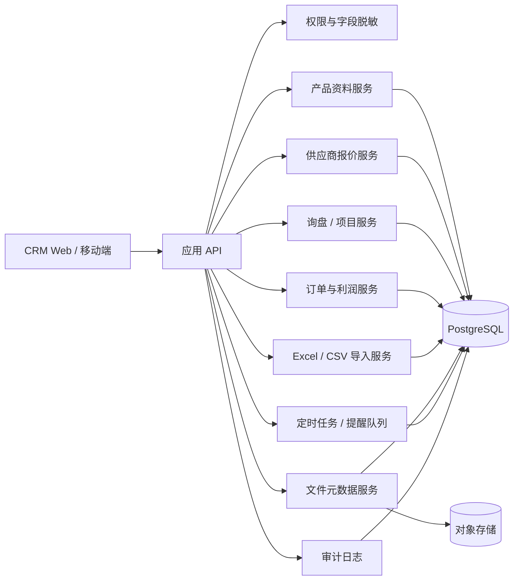
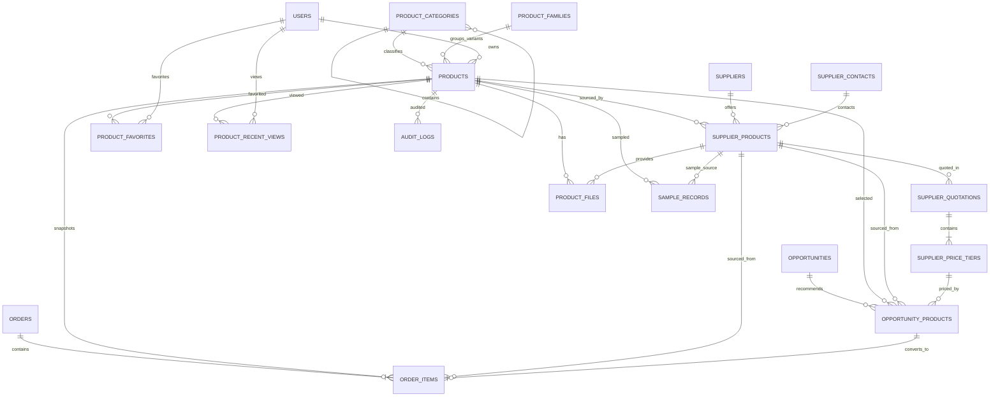

# CRM 阶段 1 设计更新：产品资料库与供应商报价管理

> 文档状态：阶段 1 设计基线（不包含业务代码）  
> 更新日期：2026-08-05  
> 模块位置：供应商管理之后、订单管理之前

## 1. 目标与设计边界

本模块建立 CRM 内部统一产品主档，将“产品是什么”“哪个供应商能提供”“供应商在某次报价中的条件”“该报价在不同数量下的阶梯单价”分层管理。它支持多供应商、多规格、多附件、多币种、报价版本与历史快照，并把产品连接到客户项目和订单。

阶段 1 只交付架构、数据模型、页面结构、迁移方案和开发计划，不生成完整业务代码。

### 核心原则

1. 产品主档不保存供应商最终价格。
2. `products` 表的一条记录代表一个可被搜索和推荐的明确规格；容量、材质、瓶口等关键规格变化时，建立独立产品记录，并可通过 `product_family_id` 归为同一产品族。
3. 供应商与产品是多对多关系，由 `supplier_products` 承载供应商型号、模具、MOQ、样品和供货能力。
4. 报价单头、报价版本和阶梯明细分离；新报价只新增版本，不更新历史版本的业务字段。
5. 项目推荐保存当时选择的供应商报价；订单明细保存产品、规格、成本、售价和汇率快照，历史数据不随主档变化。
6. 常用筛选字段结构化存储；分类特有、低频字段放入 `JSONB`。
7. 业务删除统一使用软删除；历史报价、已关联订单的快照禁止物理删除。

## 2. 系统架构更新



建议采用 PostgreSQL：结构化字段用于范围和组合查询，`JSONB` 用于分类扩展规格；图片与文档存对象存储，数据库仅保存文件元数据和受控 URL。成本、价格与利润字段通过后端权限和字段级序列化控制，不依赖前端隐藏。

## 3. 数据库关系图

### 3.1 核心 ER 图



### 3.2 表清单与职责

| 表 | 职责 | 关键说明 |
|---|---|---|
| `product_categories` | 多级产品分类 | `parent_id` 自关联；分类编码唯一 |
| `product_families` | 聚合同系列的容量/材质/颜色变体 | 补充表；避免把多个可售规格塞入一条产品记录 |
| `products` | CRM 统一产品主档/明确规格 | 自动编号 `PRD-YYYY-NNNN`；不存最终供应商报价 |
| `supplier_products` | 供应商实际产品与供货能力 | 连接产品和供应商，保存型号、模具、MOQ、样品、交期 |
| `supplier_quotations` | 一次报价的单头与版本 | 每次更新新增版本；保存币种、贸易条款、有效期、费用条件 |
| `supplier_price_tiers` | 报价版本下的阶梯价格 | 每个数量区间一行；禁止区间重叠 |
| `product_files` | 图片、视频和文档元数据 | 可归属产品或供应商产品；文件本体放对象存储 |
| `sample_records` | 样品申请、收样与评价 | 支持“收样 7 天未评价”提醒 |
| `opportunity_products` | 项目/询盘推荐产品 | 保存所选产品、供应商产品、阶梯价和客户报价 |
| `order_items` | 订单产品明细 | 保存不可变快照与利润结果 |
| `product_favorites` | 用户收藏 | 用户与产品唯一组合 |
| `product_recent_views` | 最近查看 | 按用户记录最后查看时间 |
| `audit_logs` | 操作审计 | 记录关键实体、动作、前后值与操作者 |

### 3.3 关键字段设计

附件要求的字段全部保留，以下为保证模型可实施而新增或调整的部分。

#### `product_families`（新增）

- `id`, `family_code`, `family_name`, `description`, `created_at`, `updated_at`, `deleted_at`
- `products.product_family_id` 可空外键指向该表。

#### `products`

- 保留附件列出的全部字段。
- `product_usage`、`available_decorations`、`eco_material_options`、`tags` 第一版可用 PostgreSQL 数组；若后续需配置化、多语言或统计，迁移为字典关联表。
- `capacity_value`, `weight_grams`, `overflow_capacity` 使用 `numeric`；尺寸建议补充 `length_mm`, `width_mm`, `height_mm`, `diameter_mm` 以支持范围搜索，同时保留展示字段 `dimensions`。
- 补充 `replaceable_inner_container boolean`，对应筛选要求“是否可替换内胆”。
- `specification_data jsonb NOT NULL DEFAULT '{}'`；瓶器、泵头、纸盒的分类扩展字段放在此处。
- `product_code` 唯一；`category_id`、`owner_id` 为外键；软删除记录不允许复用编号。

#### `supplier_products`

- 保留附件列出的全部字段。
- `capacity` 建议拆为 `capacity_value numeric` 与 `capacity_unit`，用于范围筛选；原始供应商描述可留在 `capacity_text`。
- 补充 `updated_at`，用它与 `last_verified_at` 计算 180 天未核实。
- 唯一规则：活动数据中 `(supplier_id, supplier_product_code)` 唯一；供应商没有编号时，以 `(supplier_id, supplier_model)` 作为人工查重候选，不强制自动合并。
- `preferred_supplier` 同一产品最多一条为真，使用部分唯一索引实现。

#### 报价模型（规范化调整）

原需求中的 `supplier_product_prices` 同时混合了“报价单头”和“阶梯明细”。为保证一份报价及其版本下有多档价格，拆为：

**`supplier_quotations`（报价单头/版本）**

- `id`, `supplier_product_id`, `quotation_number`, `quotation_version`
- `quotation_date`, `valid_until`, `currency`, `exchange_rate`, `trade_term`, `tax_included`, `unit`
- `setup_fee`, `mold_fee`, `printing_plate_fee`, `decoration_fee`, `packaging_fee`, `sample_fee`, `other_fee`
- `price_notes`, `payment_terms`, `lead_time_days`, `quotation_file`, `quoted_by`
- `is_current`, `status`, `created_at`, `updated_at`, `deleted_at`
- 唯一键：`(supplier_product_id, quotation_number, quotation_version)`。
- 同一供应商产品和报价编号最多一个活动版本 `is_current=true`；新增版本时在同一事务内切换当前标记，但不改旧版报价内容。

**`supplier_price_tiers`（阶梯明细；对应原 `supplier_product_prices` 的数量和单价部分）**

- `id`, `quotation_id`, `minimum_quantity`, `maximum_quantity`, `unit_price`
- `tier_notes`, `sort_order`, `created_at`, `updated_at`, `deleted_at`
- `maximum_quantity` 可空，表示无上限。
- 约束：最小数量大于 0；最大数量为空或不小于最小数量；同一报价版本的有效数量区间不得重叠。

若接口需要保持原名称，可建立只读视图 `supplier_product_prices`，连接报价单头与阶梯明细；写入只通过报价版本服务完成。

#### `product_files`

- 保留附件字段。
- 约束：`product_id` 必填，`supplier_product_id` 可空；若供应商产品不为空，必须属于同一产品。
- 建议补充 `storage_key`, `checksum_sha256`, `image_phash`, `uploaded_at`；图片哈希只做重复提示。

#### `sample_records`（补充）

- `id`, `product_id`, `supplier_product_id`, `opportunity_id`, `status`, `requested_at`, `received_at`, `evaluated_at`
- `sample_fee`, `currency`, `quality_score`, `evaluation_notes`, `owner_id`, `created_at`, `updated_at`, `deleted_at`

#### `opportunity_products`

- 保留附件字段；将 `selected_price_id` 明确指向 `supplier_price_tiers.id`。
- 建议增加 `cost_exchange_rate_snapshot`, `cost_trade_term_snapshot`, `price_snapshot jsonb`，确保项目复盘时能还原选价条件。
- `estimated_profit = customer_quoted_price - 折算后的 internal_cost`；币种不同时必须使用明确汇率，不允许静默按 1 计算。

#### `order_items`

- 保留附件字段，并增加 `source_opportunity_product_id`, `price_tier_id`, `exchange_rate_snapshot`, `supplier_name_snapshot`, `supplier_model_snapshot`, `trade_term_snapshot`。
- `product_name_snapshot`, `specification_snapshot`, 采购/销售价格和汇率创建后不得因主档变化自动刷新。

### 3.4 报价有效性与匹配规则

某阶梯报价可参与默认比较，必须同时满足：

1. 报价未软删除，状态为“有效”，且 `valid_until >= 当前业务日期`；
2. 报价为该报价编号的当前版本；
3. 供应商状态为“可合作”；
4. 供应商产品状态为“可采购”；
5. 查询采购数量满足 `minimum_quantity <= quantity` 且 `maximum_quantity IS NULL OR quantity <= maximum_quantity`。

目标价搜索需先按报价币种或指定汇率折算到用户选择的比较币种，再比较单价。页面必须展示原币种、原价、折算汇率、汇率日期和贸易条款，避免把 EXW、FOB、含税价误认为可直接等价比较。

### 3.5 自动汇总与性能策略

产品列表所需供应商数、有效报价数、最低有效报价、最低 MOQ、最快交期、最近报价日期等，首版使用参数化查询或数据库视图计算；数据量增长后改为物化汇总表 `product_metrics`，由报价、供应商产品、样品和订单事件增量刷新。

建议索引：

- `products(product_code)`, `products(category_id, material, capacity_value, neck_size, product_status)`；
- `GIN(products.search_keywords/tags/specification_data)`；中文名称使用适配的全文检索或 trigram 索引；
- `supplier_products(product_id, status)`, `(supplier_id, supplier_product_code)`；
- `supplier_quotations(supplier_product_id, status, valid_until, is_current)`；
- `supplier_price_tiers(quotation_id, minimum_quantity, maximum_quantity, unit_price)`；
- `opportunity_products(opportunity_id, recommendation_status)`；
- `order_items(order_id, product_id)`。

## 4. 产品模块页面结构

### 4.1 左侧导航

```text
产品中心
├─ 全部产品
├─ 产品分类
├─ 供应商产品
├─ 供应商报价
├─ 报价即将到期
├─ 样品管理
├─ 产品收藏
└─ 最近查看
```

产品中心位于“供应商管理”之后、“订单管理”之前。

### 4.2 全部产品

**列表能力**

- 表格/图片卡片切换；快速搜索；高级筛选；保存筛选条件。
- 字段：主图、产品编号、名称、分类、材质、容量、瓶口、供应商数、最低有效报价及币种、标准 MOQ、最快交期、首选供应商、最后报价日期、状态。
- 批量添加标签、批量导出、收藏、自定义列、最近查看。

**高级筛选分组**

- 基础：名称、编号、分类、用途、状态、标签/关键词。
- 规格：材质、容量数值范围与单位、瓶口、形状、泵型、PCR、可替换内胆、可回收。
- 供应：供应商/供应商编号、供应商等级、现成模具、定制模具、样品、验证状态、交期、MOQ。
- 价格：采购数量、目标单价、比较币种、贸易条款、报价有效期。

容量单位先标准化后比较；不能直接把 `30ml` 和 `0.03L` 当字符串筛选。价格结果必须绑定输入的采购数量和命中的阶梯。

### 4.3 产品详情

页头展示主图、产品编号、状态、收藏、编辑、加入项目、导出。内容使用 12 个标签页：

1. 基础资料
2. 产品图片
3. 产品规格
4. 供应商列表
5. 阶梯报价
6. 历史报价
7. 样品记录
8. 客户推荐记录
9. 关联询盘/项目
10. 关联订单
11. 文件资料
12. 操作日志

供应商对比支持选择 2 个以上供应商，横向显示供应商等级、型号、MOQ、各数量档单价、模具、样品费与时间、交期、质量/配合度评分、最近报价、有效期和首选标记。不同币种或贸易条款默认分组展示；用户主动选择统一折算后才显示折算排序。

历史报价以报价版本时间线和趋势图展示，可按供应商、币种、贸易条款和指定数量档筛选；趋势线不得把不同采购数量的阶梯价混为同一序列。

### 4.4 供应商产品

- 列表：供应商、供应商型号、关联产品、模具、MOQ、样品、交期、月产能、验证状态、最后核实时间、状态。
- 详情：供应能力、可选颜色/配件、包装物流、质量资料、关联报价、样品和文件。
- 操作：关联/更换产品主档、设置首选供应商、发起核实、标记缺货/停产。

### 4.5 供应商报价

- 报价列表按“报价编号 + 版本”显示，不按阶梯明细重复展示单头。
- 新建报价：选择供应商产品 → 填单头 → 动态添加多个阶梯 → 上传报价文件 → 校验区间 → 保存新版本。
- 历史版本只读；作废使用状态变化，不删除。
- 到期中心分“7 天内到期”“已过期”“待确认”，支持分派负责人和生成供应商核实任务。

### 4.6 样品管理

- 看板/列表：申请、寄出、已收到、待评价、已评价、关闭。
- 收样后第 7 天仍无 `evaluated_at` 时提醒负责人。
- 评价记录质量评分、图片、测试报告、结论，并回写供应商产品验证状态（需授权和确认）。

### 4.7 项目详情中的“推荐产品”

流程：搜索/批量加入产品 → 选择供应商产品 → 输入采购数量并匹配阶梯价 → 输入客户报价与汇率 → 计算成本、预计利润/利润率 → 记录反馈和样品 → 标记选定 → 转订单。

如果没有覆盖目标数量的有效阶梯，系统明确提示“无匹配有效报价”，禁止用最低档或最近一条价格静默代替。

### 4.8 订单产品明细

从项目已选定产品生成；生成前展示最终快照确认。订单保存产品、规格、供应商、采购价、销售价、币种、汇率、各项成本、毛利和毛利率快照。后续产品或供应商报价变化只产生提示，不自动改写订单。

### 4.9 首页仪表盘

增加：产品总数、本月新增、有效报价、7 天内到期报价、已过期报价、待核实产品、已验证样品、暂时缺货产品。所有卡片可下钻到已应用对应筛选的列表。

### 4.10 权限矩阵

| 能力 | 管理员 | 销售 | 采购 | 财务 |
|---|---:|---:|---:|---:|
| 查看/编辑产品主档 | 全部 | 查看；编辑按授权 | 查看/编辑供应资料 | 查看 |
| 查看供应商底价 | 全部 | 默认脱敏/按授权 | 全部 | 订单相关 |
| 新增报价版本 | 是 | 否 | 是 | 否 |
| 修改历史报价 | 禁止业务修改，仅可作废 | 否 | 禁止业务修改，仅可作废 | 否 |
| 删除/合并产品 | 是 | 否 | 否 | 否 |
| 推荐产品/客户报价 | 是 | 是 | 查看 | 查看订单相关 |
| 查看最终成交利润 | 是 | 是（自有/授权项目） | 默认否 | 是 |
| 设置首选供应商 | 是 | 否 | 按授权 | 否 |

所有底价 API 做字段级鉴权；导出、批量操作、报价作废和产品合并写入审计日志。

## 5. 数据迁移方案

1. **盘点与映射**：盘点现有 CRM、Lark、Excel/CSV 的产品、供应商、报价和文件字段，建立来源—目标字段字典及枚举映射。
2. **字典预置**：导入附件列出的默认分类及塑料瓶子分类；建立状态、用途、工艺、环保材质、贸易条款等受控字典。
3. **数据清洗**：统一容量/尺寸单位、币种代码、日期、供应商名称和型号；保留原始值到导入批次日志。
4. **分层导入**：先产品主档，再供应商产品，再报价单头/版本与阶梯，最后文件、项目关联和订单快照。
5. **重复检测**：内部产品编号精确匹配；供应商 + 供应商型号精确匹配；名称 + 容量 + 材质 + 瓶口相似匹配；图片感知哈希仅提示。
6. **人工裁决**：疑似重复支持跳过、关联现有、创建新产品、合并资料；任何图片哈希结果都不得自动合并。
7. **校验与对账**：逐批核对记录数、金额、币种、报价版本、阶梯数量、附件数、孤儿外键和失败原因。
8. **试迁移与切换**：至少一次全量试迁移和一次增量演练；业务确认后冻结旧来源写入，执行最终增量并保留只读归档。

每次导入记录 `import_batch_id`、来源文件校验和、操作者、映射版本、成功/失败数和逐行错误；失败行可下载修复后重传。

## 6. 调整后的开发计划

### 阶段 1：设计基线（当前阶段）

- 系统架构与模块边界。
- 完成本文件的 ER 图、字段责任、报价版本/阶梯模型。
- 产品中心、详情、供应商报价、项目和订单衔接的页面结构。
- 数据迁移、重复检测和回滚策略。
- 输出评审决议：币种汇率来源、单位规范、供应商状态枚举、成本可见范围。

**退出条件**：产品—供应商—报价—阶梯—项目—订单关系经业务与技术共同确认；历史报价和订单快照规则无歧义。

### 阶段 2：项目基础

- 项目初始化、PostgreSQL 基础设施、对象存储。
- 登录、角色/数据范围/字段级权限、审计日志。
- 数据库迁移框架、字典与软删除约定。

### 阶段 3：客户域

- 客户、联系人、询盘/项目。
- 项目负责人、阶段和基础权限。

### 阶段 4：协作域

- 跟进、任务、提醒与通知中心。
- 通用定时任务和事件机制，为报价/样品提醒复用。

### 阶段 5：供应商管理

- 供应商、联系人、等级、合作状态、质量与配合度评分。
- 供应商文件和基础核实流程。

### 阶段 6：产品资料库与报价（新增重点）

按依赖拆为迭代：

1. 分类、产品族和产品主档；
2. 供应商产品、多供应商关联、模具/样品/供货能力；
3. 报价版本、阶梯价格、有效性与数量匹配；
4. 图片/文件、产品详情和供应商对比；
5. 组合搜索、收藏、最近查看、产品汇总指标；
6. 项目推荐、客户报价、成本与预计利润；
7. 到期/未核实/未评价/缺货停产提醒；
8. 权限、安全、性能和本模块验收测试。

### 阶段 7：订单与利润

- 订单、订单产品明细、项目选定产品转单。
- 产品/规格/供应商/价格/汇率快照。
- 财务、采购成本、毛利和毛利率。

### 阶段 8：导入与迁移

- 产品主档、供应商产品、供应商报价三类 `.xlsx`/`.csv` 模板。
- 工作表选择、字段映射、预览、重复检测、裁决、导入报告。
- Lark 数据试迁移、对账、最终迁移。

### 阶段 9：上线准备

- 产品与报价仪表盘。
- 全角色权限回归和敏感成本泄露检查。
- 搜索、列表汇总、批量导入性能优化。
- 备份恢复、监控、部署与上线验收。

## 7. 阶段 6 验收用例基线

附件要求的 15 项测试全部纳入，细化如下：

1. 新建带结构化规格和分类扩展规格的产品主档。
2. 一个产品关联多个供应商；一个供应商关联多个产品。
3. 同一报价版本录入多个不重叠阶梯；边界数量命中唯一正确阶梯。
4. 新报价生成新版本，旧版本仍可只读查询和用于历史追溯。
5. 到期前 7 天提醒、到期后自动过期；时区按业务时区 Asia/Shanghai 测试。
6. 按材质、容量范围、瓶口、MOQ、交期和数量相关价格组合搜索。
7. 多币种折算保留汇率及日期；不同贸易条款不会被无提示混排。
8. 多图、多文件上传、排序、主图、权限下载及文件归属校验。
9. 产品加入项目、选择供应商和阶梯、计算内部成本及预计利润。
10. 无匹配阶梯或缺失汇率时阻止错误计算并给出明确提示。
11. 项目选定产品生成订单明细，字段快照完整。
12. 修改产品和新增报价后，历史订单快照不变。
13. 管理员、销售、采购、财务的底价和利润字段权限正确，API 与导出一致。
14. Excel/CSV 三类模板完成映射、预览、重复提示、人工裁决和失败报告。
15. 报价 180 天未核实、收样 7 天未评价、缺货/停产关联项目提醒准确且不重复轰炸。

## 8. 阶段 1 待业务确认项

以下事项不阻塞本设计基线，但必须在阶段 2 数据库落地前确认：

- 汇率来源、更新频率及项目/订单采用报价日还是确认日汇率。
- `供应商状态=可合作` 是否为现有枚举，若不是需统一供应商状态字典。
- 容量、尺寸、重量的标准单位和允许换算范围。
- “产品变体”是否采用本方案的一规格一产品 + 产品族，还是增加独立 SKU 层。
- 同一数量边界的业务约定；本方案采用闭区间且禁止相邻区间共享同一边界。
- 历史报价因录入错误需纠正时，采用“作废 + 新版本”而非原地修改。
- 销售人员可查看成本的授权粒度：角色、业务线、项目或单条临时授权。

